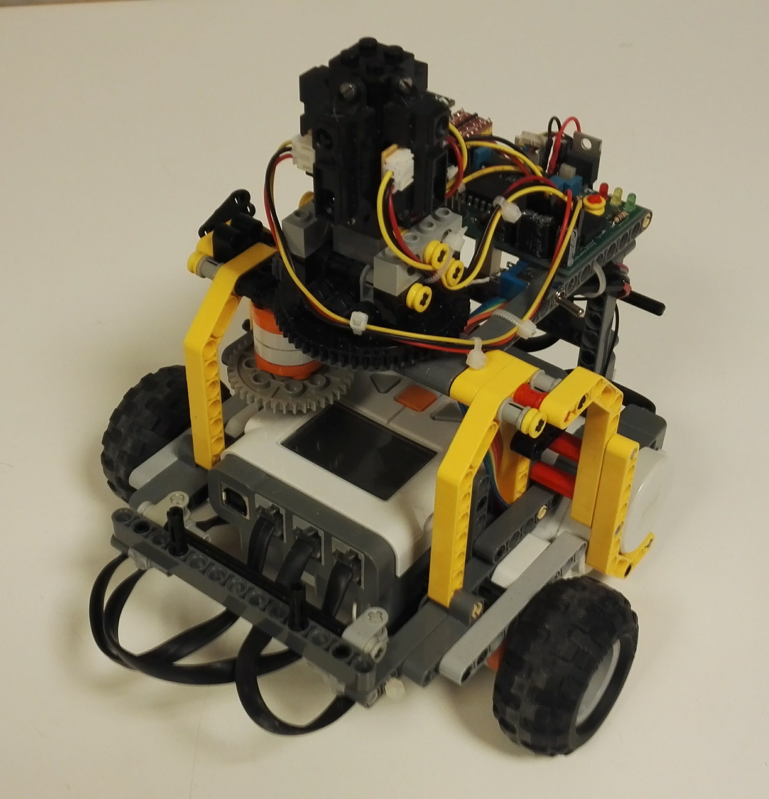

# NXT robot
Source code for the application in the NXT robot, which is part of the System of Self-Navigating Robots (SSNAR). The work is part of a master's thesis at the Department of Engineering Cybernetics at the Norwegian University of Science and Technology (NTNU).

  

Changes:
- New communication protocol by Kristian Lien NTNU, Spring 2017
- Improved pose estimation functionality by Jørund Amsen NTNU, Spring 2017
- Task for mapping functionality added by Geir Eikeland NTNU, Spring 2018
